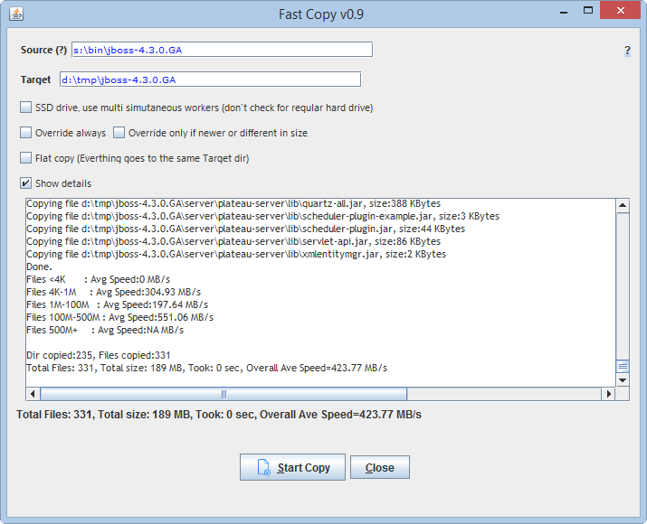

## MHISoft Fast Copy

* Copies files and directories fast.
* Speed tester for copying files of vairous sizes and locations. 
* Use multiple workers when copying from/to SSDs. 


## Download

- [Downlod the latest release] (https://github.com/mhisoft/fastcopy/releases)

## Instructions

* If not already, down load and install the latest JRE/JDK 1.7+ from Oracle.
* Exploded the downloaded zip into a directory and add the directory to the system path. 
* Windows: run the fc.bat, fc.exe or  fastcopy-console.exe for the UI version. 
* Mac OS: The "Fastcopy(1.2).app" is the MacOS app,  copy it to the ~/Applications and run.
* Unix/linux, Mac command line : run the ./fc.sh, ./fcui.sh script. 
ex:

```
    
$ ./fc.sh -help
Fast Copy (v1.2, build Oct 2018, by Tony Xue, MHISoft)
(https://github.com/mhisoft/fastcopy)
Usages:
	 fastcopy [option] -from source-dir -to target-dir 
	 source-dir: The source files and directories delimited with semicolon.
	 target-dir: The target directory.
	 Options: 
		 -v verbose mode
		 -m use multi thread for SSD
		 -o override
		 -f flat copy, copy everything to one flat target directory
		 -n override if new or different
		 -w number of worker threads, default 5
Examples:
		 copy from current dir to the backup directory: fastcopy t:\backup
		 fastcopy -from s:\projects\dir1;s:\projects\dir2 -to t:\backup
   
```


## GUI version:



* The source can be a combination of multiple directories and files delimited by the semicolon ";". You can either use the browse button to choose directories or copy paste directly into the input box. The file choose supports multiple directories selections.
* The target should always be one directory or drive. 


## Hook to the Windows Explorer Context menu
- Edit the fastcopy_reg.reg file change the path to point to where your rdpro is exploded.
double click to import into windows registry


## Add to the Mac Finder's Context menu 
* Open Automator, Files menu --> "new"
* On the "Choose a type for your document" prompt, select "Service"
* On the left in the search bar, type in "Run Shell Scripts" and select it. 
* For "Services receives selected", choose "Folders", in "Finder". Edit the path to where you installed the jar if needed. 
 
 
 


## Disclaimer
The author is not responsible for any loss of files or damage incurred by running this utility.

## License
Apache License 2.0, January 2004 http://www.apache.org/licenses/
