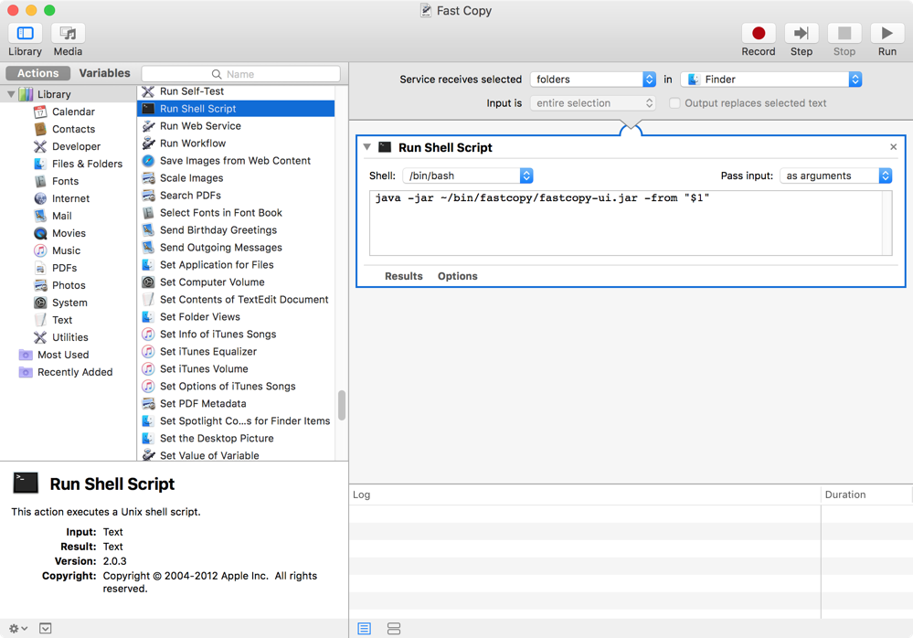

## MHISoft Fast Copy

* A very handy tool for copying directories and files, recursively, that is all the sub directories under will be copied over to the target.  The same directory tree structure will be copied over to be under the target. 
* fast.
* Speed tester for copying files of vairous sizes and locations. 
* Use multiple workers when copying from/to SSDs. 
* Supports Windows, MacOS, Unix/Linux where JRE is supported. 


## Download

- [Downlod the latest release] (https://github.com/mhisoft/fastcopy/releases)

## Instructions

* If not already, down load and install the latest JRE/JDK 1.7+ from Oracle.

* Windows: 
  Exploded the downloaded zip into a c:\bin\fastcopy and add the directory to the system path. </br>
  Run the fc.bat, fc.exe or  fastcopy-console.exe for the UI version. </br>
  Also see below on how to integrate with the windows explorer. </br>

* Mac OS: 
  Exploded the downloaded zip to ~/bin/fastcopy</br>
  The "Fastcopy(1.2).app" is the MacOS app,  copy it to the ~/Applications and run.</br>
  Also see below on how to add as service to the context menu in the Finder.</br> 


* Unix/linux, Mac command line : run the ./fc.sh

ex:

```
    
$ ./fc.sh -help
Fast Copy (v1.2, build Oct 2018, by Tony Xue, MHISoft)
(https://github.com/mhisoft/fastcopy)
Usages:
	 fastcopy [option] -from source-dir -to target-dir 
	 source-dir: The source files and directories delimited with semicolon.
	 target-dir: The target directory.
	 Options: 
		 -v verbose mode
		 -m use multi thread for SSD
		 -o override
		 -f flat copy, copy everything to one flat target directory
		 -n override if new or different
		 -w number of worker threads, default 5
Examples:
		 copy from current dir to the backup directory: fastcopy t:\backup
		 fastcopy -from s:\projects\dir1;s:\projects\dir2 -to t:\backup
   
```


## GUI version:


* The source can be a combination of multiple directories and files delimited by the semicolon ";". You can either use the browse button to choose directories or copy paste directly into the input box. The file choose supports multiple directories selections.
* The target should always be one directory or drive. 
* Check the SSD deivers to leverage multiple works for copying files simuteneously.  usually it should speed things up if there no other bottlenecks on such as the network or calbe, ports.
* The "override only if newer or a size difference is detected" is handy to when you need to stop and resume a copy task. say you stop a copying task in the middle , when you resume it by running again , it will skip the already copied files on the target directory and copies only the not yet copied over files. 
* "Create the same source folder..." option, for example: 
source is "/Users/myhome/Repository", target is "/Volumes/externaldrive/backup", with this option checked, a "Repository" diorectory will be created under /Volumes/externaldrive/backup and the contents under the source will be copied to /Volumes/externaldrive/backup/Repository


## Hook to the Windows Explorer Context menu
- Edit the fastcopy_reg.reg file change the path to point to where your rdpro is exploded.
double click to import into windows registry


## Add to the Mac Finder's Context menu 
* Open Automator, Files menu --> "new"
* On the "Choose a type for your document" prompt, select "Service"
* On the left in the search bar, type in "Run Shell Scripts" and select it. 
* For "Services receives selected", choose "Folders", in "Finder". Edit the path to where you installed the jar if needed. 
 
 
 


## Disclaimer
The author is not responsible for any loss of files or damage incurred by running this utility.

## License
Apache License 2.0, January 2004 http://www.apache.org/licenses/
